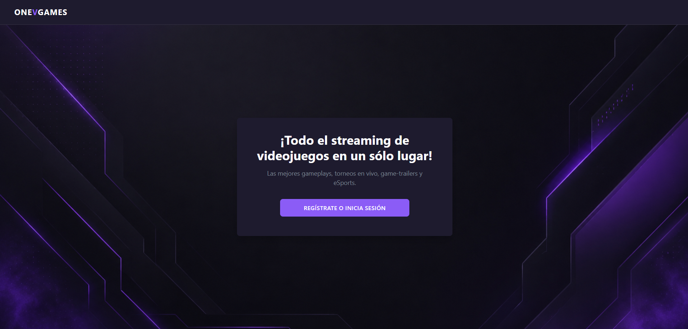
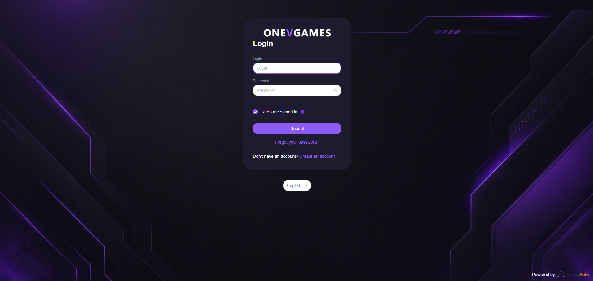
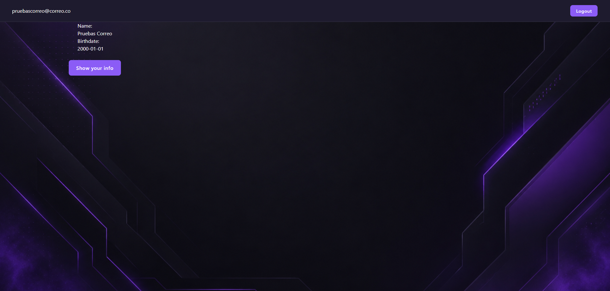
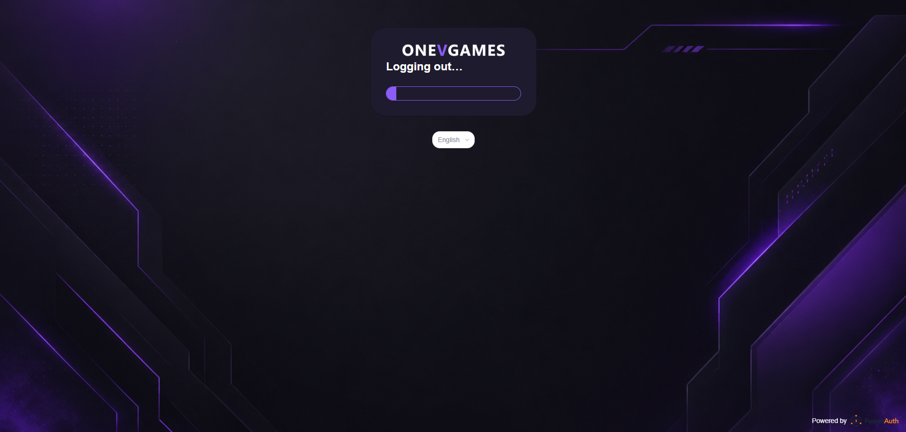

# ONE ACCESS LAB

## Descripción

Este proyecto es una solución de demostración que integra:
- Frontend en React + Vite (`frontend/`)
- Backend en FastAPI (`api/`)
- FusionAuth como proveedor de autenticación
- PostgreSQL como base de datos
- MailHog para capturar correos en desarrollo

La aplicación permite iniciar sesión con FusionAuth y mostrar el perfil del usuario en la página de cuenta.

## Arquitectura

- `docker-compose.yaml`: levanta los servicios principales.
- `frontend/`: aplicación React que usa `@fusionauth/react-sdk`.
- `api/`: backend FastAPI que valida el JWT de FusionAuth y devuelve datos de perfil.
- `api/routers/profile_api.py`: endpoint `/api/account/profile`.
- `api/routers/status_api.py`: endpoint `/status` para health checks.

## Requisitos previos

- Docker y Docker Compose instalados.
- Node.js y npm (opcional, solo si quieres ejecutar el frontend en modo desarrollo fuera de Docker).
- Python 3.11 (opcional, si quieres ejecutar el backend en modo desarrollo fuera de Docker).

## Configuración de variables de entorno

El proyecto usa tres archivos de configuración:

- `./.env` → variables de entorno para Docker Compose.
- `api/.env` → configuración del backend (CORS, FusionAuth, etc.).
- `frontend/.env` → configuración de Vite para FusionAuth y backend.

### Variables principales

#### `./.env`

```env
POSTGRES_DB=fusionauth_db
POSTGRES_USER=fusionauth
POSTGRES_PASSWORD=fusionauth123
```

#### `api/.env`

```env
FRONTEND_URI=http://127.0.0.1:3000
API_KEY_FusionAuth=<tu_api_key>
```

> `FRONTEND_URI` debe coincidir con la URL desde la que se sirve el frontend.

#### `frontend/.env`

```env
VITE_CLIENT_ID=<client-id-de-fusionauth>
VITE_FUSIONAUTH_URL=http://127.0.0.1:9011
VITE_BACKEND_URL=http://127.0.0.1:8030
VITE_REDIRECT_URI=http://127.0.0.1:3000/account
VITE_REDIRECT_URI_POST_LOGOUT=http://127.0.0.1:3000
```

> Asegúrate de que los valores en `frontend/.env` coincidan con la configuración del cliente en FusionAuth.

## Instalación y ejecución con Docker

1. Copia las variables de ejemplo y ajusta los valores si es necesario:
   - `cp .env.example .env`
   - `cp api/.env.example api/.env`
   - `cp frontend/.env.example frontend/.env`

2. Construye y levanta los servicios:

```bash
docker compose up --build
```

3. Accede a los servicios:

- Frontend: `http://localhost:3000`
- FusionAuth: `http://localhost:9011`
- Backend: `http://localhost:8030`
- Health check: `http://localhost:8030/status`
- MailHog: `http://localhost:8025`

4. Para ejecutar en segundo plano:

```bash
docker compose up -d --build
```

5. Para detener y limpiar:

```bash
docker compose down
```

## Ejecución en desarrollo sin Docker

### Backend

```bash
cd api
python -m venv env
env\Scripts\activate
pip install -r requirements.txt
uvicorn apimain:app --reload --host 0.0.0.0 --port 8030
```

### Frontend

```bash
cd frontend
npm install
npm run dev
```

## Configuración de FusionAuth

1. Abre `http://localhost:9011`.
2. Inicia sesión en el panel de administrador.
3. Crea una aplicación o cliente OpenID Connect con:
   - `Client Id`: el mismo valor de `VITE_CLIENT_ID`.
   - `Server URL`: `http://127.0.0.1:9011`.
   - `Redirect URI`: `http://127.0.0.1:3000/account`.
   - `Post Logout Redirect URI`: `http://127.0.0.1:3000`.
   - Origin/Allowed Origins: `http://127.0.0.1:3000`.
   - Scopes: `openid email profile offline_access`.
4. Verifica que la aplicación esté habilitada y asigna el `Client Id` al frontend.

## Flujo de la aplicación

1. El usuario ingresa a `http://localhost:3000`.
2. El frontend muestra la pantalla de bienvenida y el botón `REGÍSTRATE O INICIA SESIÓN`.
3. Al hacer clic, FusionAuth maneja el login.
4. Después del login, el usuario es redirigido a `/account`.
5. El backend consulta la cookie `app.at` y decodifica el token JWT,
   devolviendo el perfil con email, nombre y fecha de nacimiento.

## Endpoints importantes

- `GET /status` → estado del backend.
- `GET /api/account/profile` → devuelve los datos del usuario autenticado.

## Estructura del frontend

- `frontend/src/main.tsx`: configuración de `FusionAuthProvider`.
- `frontend/src/home.tsx`: página de login y redirección.
- `frontend/src/account.tsx`: muestra datos del usuario y permite logout.

## Estructura del backend

- `api/apimain.py`: configuración de FastAPI y CORS.
- `api/routers/profile_api.py`: endpoint de perfil y validación JWT.
- `api/routers/status_api.py`: endpoint de estado.

## Pantallazos del aplicativo

A continuación se describe qué pantallas debería mostrar la aplicación.

1. **Pantalla de bienvenida / login**
    
    
   - Título: `ONEVGAMES`
   - Texto: `¡Todo el streaming de videojuegos en un sólo lugar!`
   - Botón: `REGÍSTRATE O INICIA SESIÓN`
   

2. **Pantalla de cuenta**
    
   - Muestra el email del usuario.
   - Muestra datos como nombre, apellido y fecha de nacimiento.
   - Botón `Logout`.
   

3. **Panel de FusionAuth**
    
   - Configuración de la aplicación OpenID Connect.
   - Redirecciones configuradas.
   - Usuario autenticado.

4. **Estado de Docker Compose**
   - Servicios `mailhog`, `database`, `fusionauth`, `frontend`, `backend` funcionando.

> Si quieres agregar imágenes reales, crea la carpeta `docs/screenshots/` y añade los archivos allí. Luego reemplaza los placeholders del README con las rutas `docs/screenshots/<nombre>.png`.

## Notas adicionales

- El backend usa `api/.env` para leer `FRONTEND_URI`.
- El frontend usa `frontend/.env` para construir las URLs de FusionAuth.
- Si el login falla, revisa que `VITE_REDIRECT_URI` y `VITE_REDIRECT_URI_POST_LOGOUT` estén correctamente configurados en FusionAuth.
- Si la API responde error 401, comprueba que la cookie `app.at` exista y sea valida.

## Comandos útiles

```bash
# Levantar todo con Docker Compose
docker compose up --build

# Detener todo
docker compose down

# Iniciar frontend en desarrollo
cd frontend
npm install
npm run dev

# Iniciar backend en desarrollo
cd api
pip install -r requirements.txt
uvicorn apimain:app --reload --host 0.0.0.0 --port 8030
```
