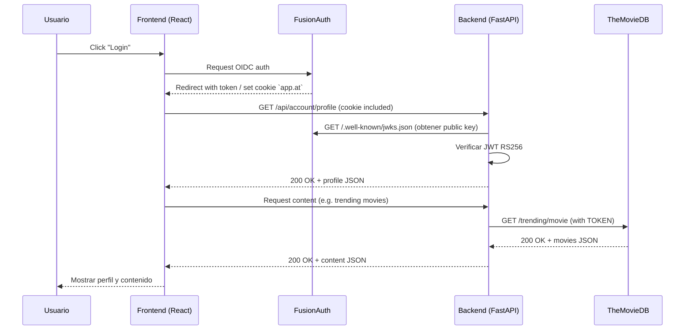
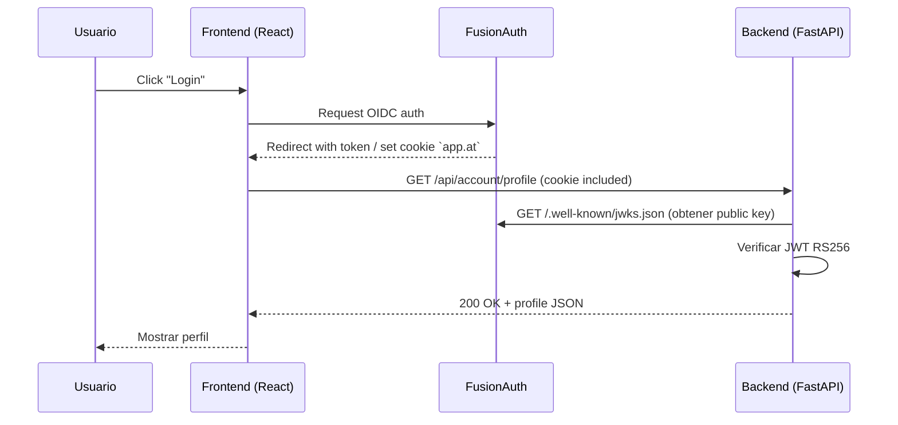

# Documentación Técnica — ONE ACCESS LAB

## Resumen

Este documento describe con detalle la arquitectura, componentes, flujos de autenticación y consideraciones operacionales del proyecto.

## Componentes

- Frontend (React + Vite): sirve la UI y usa `@fusionauth/react-sdk` para iniciar el flujo OIDC.
- Backend (FastAPI): valida tokens/cookies emitidos por FusionAuth y expone endpoints de perfil y estado.
- FusionAuth: servidor de identidad OpenID Connect (ej. usuarios, clientes, tokens).
- PostgreSQL: almacén de datos para FusionAuth.
- MailHog: captura correos en entorno de desarrollo.
 - TheMovieDB (TMDB): proveedor externo de contenidos (listados, imágenes, metadata).

## Puertos y rutas principales

- `3000` Frontend (Nginx en Docker image de producción o Vite en dev).
- `9011` FusionAuth.
- `8030` Backend FastAPI.
- `8025` MailHog UI.

## Variables de entorno claves

- `POSTGRES_DB`, `POSTGRES_USER`, `POSTGRES_PASSWORD` (docker-compose).
- `FRONTEND_URI` (api/.env) — origen permitido para CORS.
- `API_KEY_FusionAuth` — clave administradora usada por scripts/consumos administrativos.
- `VITE_CLIENT_ID`, `VITE_FUSIONAUTH_URL`, `VITE_BACKEND_URL`, `VITE_REDIRECT_URI` (frontend/.env).

## Flujo de autenticación (resumido)

1. Usuario hace clic en login en frontend → `@fusionauth/react-sdk` inicia OIDC authorization code flow (o implicit flow según configuración).
2. FusionAuth autentica y redirige a `VITE_REDIRECT_URI` con el token/authorization code.
3. En este proyecto se utiliza la cookie `app.at` para transportar el token de acceso en el navegador.
4. Frontend hace solicitudes a `GET /api/account/profile` incluyendo cookies (credentials: 'include').
5. Backend extrae la cookie `app.at`, recupera la clave pública de FusionAuth (`/.well-known/jwks.json`) y decodifica el JWT con `RS256`.
6. Si el token es válido, el backend devuelve los claims esperados (`email`, `given_name`, `family_name`, `birthDate`).

## Integración con TMDB

El backend utiliza varios endpoints de TMDB para obtener contenido (p. ej. trending movies/TV) y la URL base para imágenes. Estas variables se configuran en `api/.env`:

- `TOKEN` — token o API Key para TMDB.
- `urlTrendingMovies`, `urlTrendingTV` — endpoints para trending.
- `BASE_IMAGE` — URL base de imágenes (`https://image.tmdb.org/t/p/w500`).

Se recomienda usar cache (Redis o similar) y manejar errores y límites de tasa provistos por TMDB.

### Diagrama de secuencia (incluye TMDB)



### Diagrama de secuencia



## Endpoints y contratos

- `GET /status` → devuelve `ON LINE`.
- `GET /api/account/profile` → requiere cookie `app.at` válida; devuelve JSON con `email`, `given_name`, `family_name`, `birthDate`.

Formato de respuesta de `/api/account/profile`:

```json
{
  "email": "user@example.com",
  "given_name": "Nombre",
  "family_name": "Apellido",
  "birthDate": "YYYY-MM-DD"
}
```

## Persistencia y volúmenes

- `postgres_data` volumen en `docker-compose.yaml` para persistir datos de PostgreSQL.

## Observabilidad y logs

- El backend escribe logs diarios en `./logs/YYYY-MM-DD.log` (ver `status_api.py`).
- MailHog UI: revisar correos de confirmación o notificaciones en desarrollo.

## Seguridad y recomendaciones

- Asegurar que `API_KEY_FusionAuth` se guarde de forma segura (no en repositorios públicos).
- Forzar HTTPS en entornos de producción y ajustar `redirectUri` y `postLogoutRedirectUri` en FusionAuth.
- Revisar expiración de tokens y refresh tokens si se usa `offline_access`.

## Despliegue y operación

- Para despliegue local o staging usar `docker compose up --build`.
- Para producción, desplegar FusionAuth con respaldo de base de datos administrada, usar redes privadas y configurar `host.docker.internal` o direcciones internas apropiadas.

## Desarrollo y pruebas

- Ejecutar frontend con `npm run dev` y backend con `uvicorn apimain:app --reload` para desarrollo iterativo.
- Usar MailHog para interceptar envíos de correo durante pruebas.

## Preguntas frecuentes técnicas

- ¿Dónde se valida el token? → En `api/routers/profile_api.py` se usa la clave pública y `jose.jwt.decode`.
- ¿Cómo se obtiene la clave pública? → Desde `FUSIONAUTH_JWKS_URL` (`/.well-known/jwks.json`).

